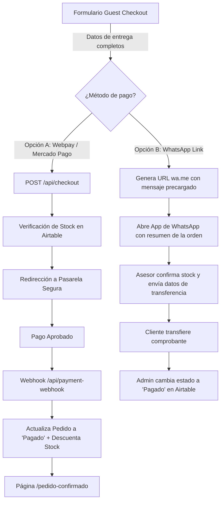

# Especificación de Métodos de Pago: Pasarela Automática y WhatsApp Link

**Estado:** Aprobado  
**Enfoque:** Checkout Híbrido de Máxima Conversión (Autoservicio + Asistido)

---

## 1. Estrategia de Métodos de Pago

Para una tienda de mascotas pequeña (<100 productos), ofrecer dos caminos de pago reduce el abandono al mínimo:

1. **Camino A (Pasarela Online Automática - Webpay Plus / Mercado Pago):**  
   Para clientes que prefieren autogestión, tarjeta de débito/crédito y confirmación instantánea.
2. **Camino B (Pedido Asistido vía WhatsApp Link):**  
   Para clientes que prefieren transferencia bancaria previa confirmación de stock, dudas sobre dosis de antiparasitarios o atención humana inmediata.

---

## 2. Flujo A: Pasarela Online Automática

### A. Secuencia Técnica (Webpay / Mercado Pago)
1. El usuario completa el formulario Guest Checkout y selecciona `Webpay Plus` o `Mercado Pago`.
2. Al presionar **"Ir a Pagar"**, el frontend realiza un `POST` al endpoint Serverless `/api/checkout`.
3. El backend verifica stock en Airtable, genera el token de transacción (`initiateTransaction`) y redirige al usuario a la pasarela segura.
4. Una vez procesado el pago en Transbank/Mercado Pago:
   - Se invoca el webhook `/api/payment-webhook`.
   - Se actualiza la orden en Airtable a estado `Pagado`.
   - Se descuenta automáticamente el inventario del SKU.
   - Se redirige al cliente a `/pedido-confirmado?orderId=ORD-XXXXXX`.

---

## 3. Flujo B: Pedido Asistido vía WhatsApp Link (Mensaje Estructurado)

### A. Generación de Enlace Dinámico
Si el cliente selecciona `Pedido vía WhatsApp` o `Transferencia Asistida`, el sistema genera una URL de WhatsApp API (`https://wa.me/56912345678?text=...`) codificada con `encodeURIComponent` conteniendo el detalle completo de la compra.

### B. Plantilla del Mensaje Precargado

```text
🐾 *NUEVO PEDIDO EN LOLA PET*
----------------------------------------
*N° de Orden:* ORD-849201
*Fecha:* 01/09/2026

*DATOS DEL CLIENTE:*
• *Nombre:* Camila Silva
• *RUT:* 18.492.019-K
• *Teléfono:* +56 9 8765 4321
• *Email:* camila@ejemplo.com
• *Dirección:* Av. Providencia 1234, Depto 402 (Providencia)

*DETALLE DEL PEDIDO:*
1. Alimento Super Premium Perro Adulto (15 Kg) x 1 - $48.990
2. Snack Dental Stick Masticables Perro (Pack 7) x 2 - $9.980

----------------------------------------
*TOTAL A PAGAR:* $58.970 CLP
*Método preferido:* Transferencia Bancaria Directa

Por favor enviar datos de cuenta bancaria para realizar la transferencia. ¡Gracias!
```

---

## 4. Matriz Comparativa de Comportamiento

| Característica | Pasarela Online (Webpay / MP) | WhatsApp Link |
| :--- | :--- | :--- |
| **Tiempo de Confirmación** | Instantáneo (Servidor a Servidor) | Asistido (Manual por operador) |
| **Reserva de Stock** | Bloqueo temporal inmediato | Confirmación previa por asesor |
| **Comisión por Venta** | ~2.5% a 3.2% + IVA | 0% (Transferencia directa) |
| **Ideal para** | Compras rápidas en tarjeta | Consultas de dosis, alimentos y transferencias |

---

## 5. Implementación en Código

Tanto el componente React (`GuestCheckoutForm.tsx`) como el script de demostración estática (`checkout.html`) contemplan ambos flujos seleccionables mediante un selector de radio con íconos descriptivos:
- `💳 Webpay Plus`
- `🛍️ Mercado Pago`
- `💬 Pedido por WhatsApp`

## 6. Diagrama del Flujo Híbrido de Pago



```text
┌────────────────────────────────────────────────────────┐
│                  FORMULARIO CHECKOUT                   │
│       (Datos de entrega: Nombre, RUT, Comuna, etc.)    │
└───────────────────────────┬────────────────────────────┘
                            │
          ¿Qué método de pago elige el cliente?
                            │
        ┌───────────────────┴───────────────────┐
        ▼                                       ▼
[ Opción A: Pago Online ]               [ Opción B: WhatsApp ]
(Débito / Crédito / Prepago)          (Link de Pago / Transferencia)
        │                                       │
        ▼                                       ▼
 Redirección a Webpay / MP              Envío de orden a WhatsApp
        │                                       │
        ▼                                       ▼
 Confirmación automática                Admin responde con datos de cuenta
        │                                       │
        ▼                                       ▼
 Descuento de stock en Airtable         Cliente envía comprobante
```

