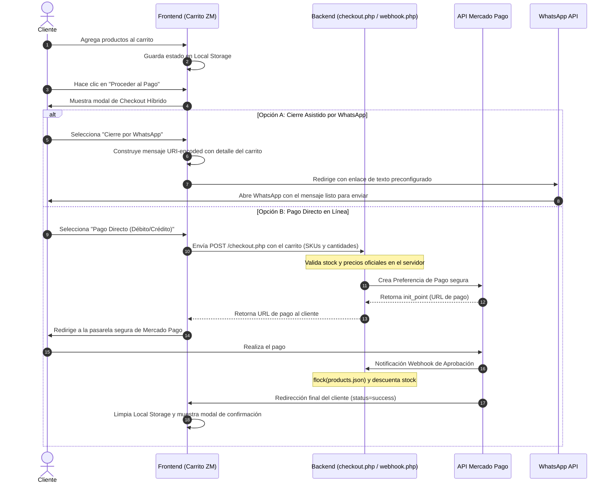

# Documentación Técnica y Arquitectura de Datos — ZM (Zona de Músicos)

Esta documentación técnica detalla la arquitectura de datos, los requerimientos funcionales y no funcionales, y los flujos de usuario de la tienda **ZM** para satisfacer las especificaciones definidas en [reqs.md](file:///c:/Users/nicol/OneDrive%20-%20Carver%20University/Studio156/ZDM/docs/reqs.md).

---

## 1. Esquema de Arquitectura de Datos

La arquitectura de ZM está diseñada para ser ligera, rápida y descentralizada. Evita el uso de bases de datos relacionales tradicionales (como MySQL o PostgreSQL) en la carga del cliente para priorizar el rendimiento (Core Web Vitals), utilizando **Airtable** como panel de administración central del propietario y **`products.json`** como caché estática de lectura de alto rendimiento.

```mermaid
graph TD
    subgraph Propietario (Back-Office)
        AT[Airtable: Gestión Visual]
        ADB[Panel Admin Local: CRUD PHP]
    end

    subgraph Integración y Sincronización
        MK[Make / Zapier / Scripts]
        PJ[products.json: Caché Estática]
    end

    subgraph Cliente (Frontend)
        FE[Navegador del Usuario: HTML/CSS/JS]
        LS[Local Storage: Carrito ZM]
    end

    subgraph Pasarelas Externas
        MP[API Mercado Pago]
        WA[Enlace WhatsApp Checkout]
    end

    AT -->|Sincronización Webhook / API| PJ
    ADB -->|Edición Directa con Bloqueo flock| PJ
    PJ -->|Fetch de Lectura Instantánea| FE
    FE <--->|Persistencia Local| LS
    FE -->|Checkout Asistido| WA
    FE -->|Checkout Pago Directo| MP
```

### Flujo de Sincronización de Catálogo:
1. **Airtable**: El propietario del negocio de ZM gestiona el catálogo de forma visual en Airtable (nombre, precio, stock, descripción, foto, estado, destacado).
2. **Make/Zapier o API local**: Un webhook de Airtable o un script periódico descarga las filas activas en formato JSON y regenera el archivo `products.json` de la tienda.
3. **Caché en Servidor**: El frontend del usuario realiza una llamada `fetch('products.json')` estática. Al tratarse de un archivo estático, la velocidad de carga es ultra rápida (<100ms) y altamente escalable bajo CDN.

---

## 2. Flujo de Usuario: Checkout Híbrido

ZM ofrece dos alternativas de cierre de compra para maximizar la conversión según la preferencia del cliente:



---

## 3. Requerimientos Funcionales Desarrollados

### 1. Gestión de Catálogo
- **CRUD Back-Office**: Para administración local, se cuenta con `admin.php` protegido por sesión, permitiendo crear, leer, actualizar y borrar productos de forma directa en la base de datos estática `products.json` con subida de imágenes optimizada y saneada.
- **Sincronización con Airtable**: Los productos se mapean por su código SKU único. El campo `stock` se descuenta de forma transaccional tanto en el inventario local como a través de integraciones externas al recibir compras aprobadas.

### 2. Flujo de Compra Híbrido
- **Cierre por WhatsApp**: Automatizado mediante código JS en `app.js`. Extrae el carrito, calcula el total del pedido en pesos chilenos (CLP) y genera un mensaje con formato amigable:
  ```text
  ¡Hola amigos de ZM! Me gustaría reservar los siguientes artículos de su catálogo:
  - 1x Guitarra Clásica de Concierto 'Aura' (SKU: ZM-GTR-01) - $1.250.000
  Total Estimado: $1.250.000
  ```
- **Pago Directo (Mercado Pago)**: Integración segura mediante API. `checkout.php` actúa como capa de validación intermedia para evitar que el cliente altere los precios desde la consola del navegador, creando la preferencia solo con el inventario real.

### 3. Carrito de Compras
- **Persistencia en Local Storage**: El carrito se almacena en el navegador bajo la llave `zm_cart` y la lista de deseos en `zm_wishlist`. La velocidad de sincronización es instantánea, sin necesidad de sesiones de servidor pesadas.

---

## 4. Requerimientos No Funcionales

### 1. Rendimiento (Core Web Vitals)
- **Eliminación de Bloatware**: Arquitectura pura en HTML, CSS vanilla y Javascript modular. Cero dependencias pesadas de frameworks en la interfaz del cliente.
- **Optimización de Assets**: Las imágenes cuentan con atributo `loading="lazy"` para evitar cargas de renderizado bloqueantes. Se recomienda el uso de formatos `.webp`.

### 2. Usabilidad (UX/UI y Accesibilidad)
- **Paleta Minimalista**: Diseño sofisticado en color negro (`#080808`), tarjetas en gris oscuro (`#121212`) y detalles dorados elegantes (`#cca025`).
- **Navegabilidad de Teclado (WCAG 2.1 AA)**: 
  * Se configuró un anillo de enfoque `:focus-visible` dorado en todos los enlaces y elementos seleccionables.
  * Los modales e interfaces de checkout cuentan con **Focus Trap** (`lockFocus`), impidiendo que el cursor del teclado navegue por detrás del modal mientras está abierto.

### 3. Seguridad
- **Protección de Datos (Ley N° 21.719 de Chile / GDPR)**:
  * El banner de cookies bloquea de manera proactiva scripts de seguimiento analítico y de marketing hasta obtener consentimiento explícito.
  * Los botones "Aceptar todas", "Rechazar todas" y "Configurar" tienen el mismo nivel de jerarquía visual (sin sesgo de diseño oscuro).
  * Casillas de aceptación del newsletter desmarcadas por defecto y separadas de los términos promocionales.
  * Formulario gratuito e integrado para el ejercicio de derechos ARCO+P.
- **Sanitización de Entradas**: Sanitización con expresiones regulares para SKU y saneado de HTML con `htmlspecialchars()` en PHP y JS para mitigar ataques XSS.
- **HTTPS Forzado**: Redirección permanente permanente (`301`) implementada en el backend y cabeceras HSTS y HSTS Subdomains activas.

---

## 5. Guía de Tecnologías Recomendadas para la Integración

Para conectar la interfaz visual de Airtable del propietario con el archivo `products.json` de forma automática, se proponen las siguientes opciones:

### Opción A: Make (anteriormente Integromat) — Recomendado por simplicidad
1. **Trigger**: Airtable (Watch Records - Cuando se modifica un registro en la tabla de productos).
2. **Action**: Convertir registros de Airtable a una estructura JSON que coincida con el esquema de `products.json`.
3. **Action (FTP/SSH)**: Subir el archivo JSON resultante al servidor hosting de la tienda sobreescribiendo el archivo `products.json` en tiempo real.

### Opción B: Script PHP en el Servidor (Sincronización Directa)
Un endpoint protegido en PHP que consuma la API REST de Airtable utilizando el Token de Acceso Personal (PAT) del cliente para descargar y escribir localmente el inventario.

---

## 6. Recomendaciones de Seguridad para Gestión de APIs de Pago

1. **Rotación de Tokens**: Guardar las credenciales `MP_ACCESS_TOKEN` y `MP_PUBLIC_KEY` fuera del entorno web público, o inyectarlas mediante variables de entorno del servidor.
2. **Firma de Webhooks**: Validar la firma digital o token secreto enviado por Mercado Pago en cada IPN para certificar que la notificación proviene realmente de sus servidores y no de un atacante.
3. **HTTPS Requerido**: El endpoint `webhook.php` requiere obligatoriamente HTTPS habilitado y certificado SSL vigente para recibir notificaciones y evitar escuchas pasivas en el canal.
4. **Tono del Sitio**: Cercano, profesional, poético y directo. Sin explicaciones técnicas confusas para los clientes amantes de la música.
